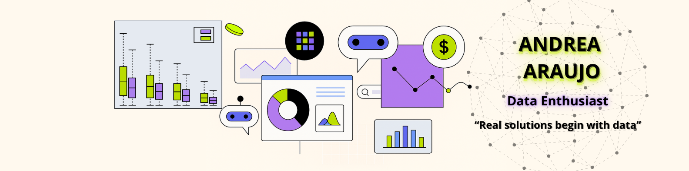

  

 
  <h1 align="center"> Hey there! , I'm Andrea</h1>
  <h3 align="center" style="font-weight: normal; font-size: 1.2em; line-height: 1.5;">
    I love exploring data 👩🏻‍💻, discovering patterns 🔍,  
    and turning numbers into stories ✨. 
  </h3>

 
  <h3> 📫 How to reach me: </h3>

### 📌 About Me

- Technology enthusiast 💻  
- Expanding my skills in data analysis 📊  
- Every day is a joy for me to learn something new 🌱  
- Additionally, I have experience with MATLAB, LabVIEW, Proteus, and MPLAB — tools from my technical background 🔧  

🚧 My repository is still under construction — new projects coming soon!
<!--
**andreavaraujor/andreavaraujor** is a ✨ _special_ ✨ repository because its `README.md` (this file) appears on your GitHub profile.

Here are some ideas to get you started:

- 🔭 I’m currently working on ...
- 🌱 I’m currently learning ...
- 👯 I’m looking to collaborate on ...
- 🤔 I’m looking for help with ...
- 💬 Ask me about ...
- 📫 How to reach me: ...
- 😄 Pronouns: ...
- ⚡ Fun fact: ...
-->
